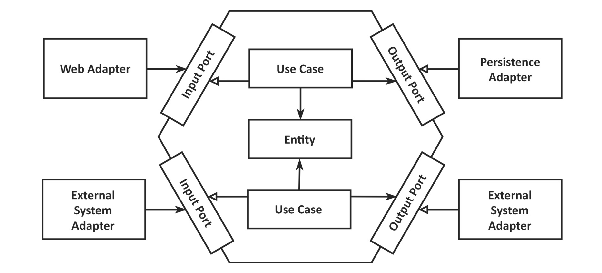

# Hexagonal architecture app

1. [Profielen](docs/profielen.md)
2. [Component configuratie](docs/component-configuratie.md)
3. [Postgres](docs/postgres.md)
4. [Docker](docs/docker.md)

## Short description

This is an example of a production-ready hexagonal architecture project setup.
It also shows a very simple OO model (rich domain model).
Hexagonal architecture was invented by such by Alistair Cockburn, and has been implemented in this
application.

